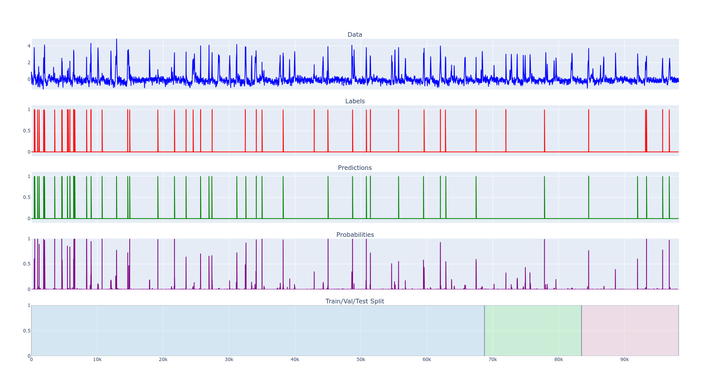
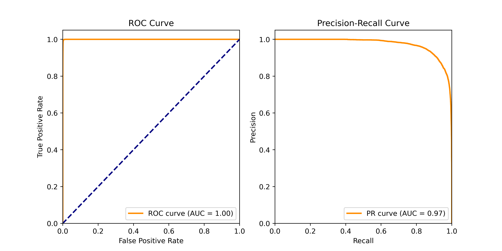
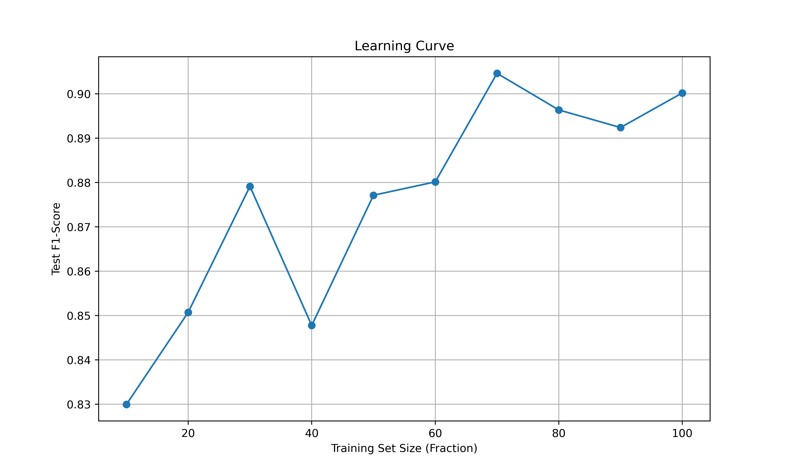

# DeepLearning_FinalProject
Try out the single_suite.html interactive plot.
## Results
Stacked plot of Denoised Trace, Ground Truth, Predicted Labels, Predicted Probabilities and Train/Val/Test split.

## Metrics

Impact of Training Size on Dataset

